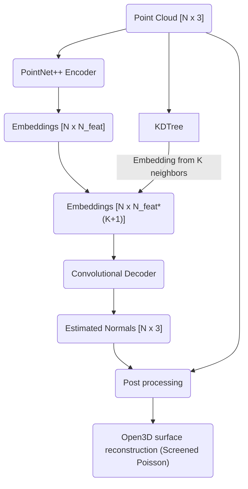

Trying out an idea. Basically:

> The background noise points are set to be predicted as all zeros (which is never possible for a real normal). The output will be post_processed to spot these points using a small threshold and remove them. Foreground noise points are currently staying in the output.
