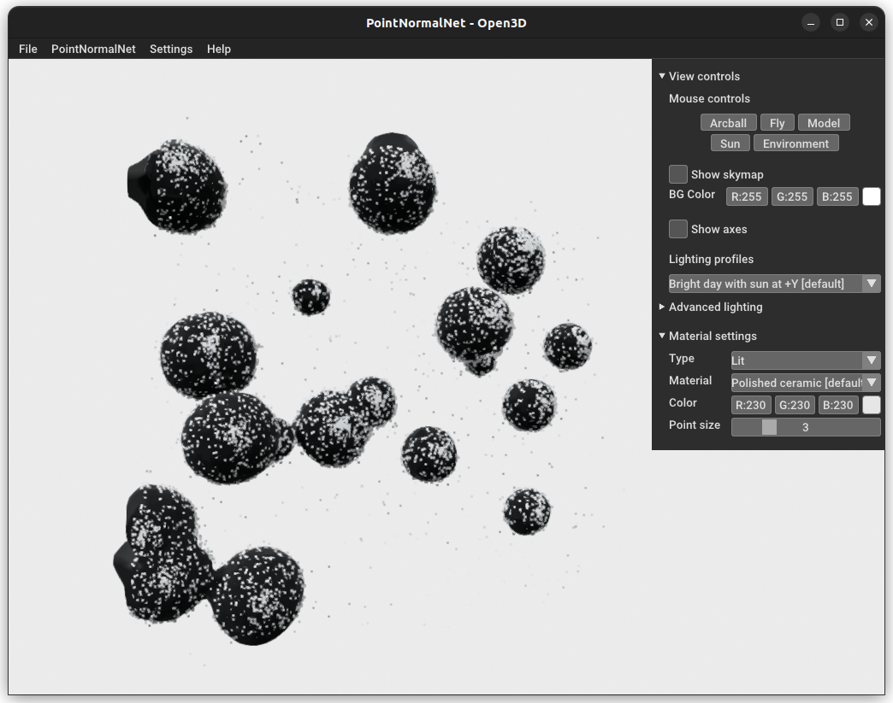

# PointGraphNet


## Usage Instructions
This directory holds the trained weights for the model, along with some example input data (in `examples/`), and some scripts for testing the model. You can utilise the model in multiple ways:

### 1. OpenGL-based Open3D GUI
Open3D provides a decent GUI interface for visualizing 3D objects. There is a small GUI demo inside `demo_gui.py`. You can run it with the following command:
```bash
> python demo_gui.py
```

The GUI is easy-to-use, and provides ease of visualization. Usage instructions for the GUI can be accessed by accessing the help menu. Here's a screenshot of the GUI:


### 2. Command-line interface
`inference.py` provides a command-line interface for running the code and trying out the model. It takes in an SMLM point cloud as input, and saves the estimated 3D reconstruction in the specified output directory.

Here's the help message for the script:
```bash
> python inference.py -h
usage: inference.py [-h] [--ckpt_dir CKPT_DIR] -i INPUT [-o OUTPUT_PATH] [--noise-thresh NOISE_THRESH]
                    [--max-n MAX_N] [--device DEVICE] [--visualize]

optional arguments:
  -h, --help            show this help message and exit
  --ckpt_dir CKPT_DIR   Path to the checkpoint directory. Defaults to
                        core/static/weights/stratefy1_run2_v2_pgn
  -i INPUT, --input INPUT
                        Path to the input file (csv/tsv/parquet with at least three columns: x, y, z).
                        Header row is optional if only three columns are present. Can automatically
                        detect these common sets of column headers: ["x", "y", "z"], ["X", "Y", "Z"],
                        ["x [nm]", "y [nm]", "z [nm]"], ["X [nm]", "Y [nm]", "Z [nm]"]
  -o OUTPUT_PATH, --output_path OUTPUT_PATH
                        A directory path to save the outputs. If not specified, will be saved in the
                        same directory as the input file.
  --noise-thresh NOISE_THRESH
                        The noise threshold. Defaults to 0.5.
  --max-n MAX_N         The maximum number of points to use in one batch. Defaults to 100k.
  --device DEVICE       The device to use for inference ("cpu", "cuda"). Defaults to "cuda".
  --visualize           Visualize the resulting 3D reconstruction.
```

### 3. Python API
`inference.py` has all the necessary function definitions one would need to run the model. You can import the functions from `inference.py` and use them with your own code. The code is well-documented, and should be easy to use.

## Training Instructions
You can also train you own model using the code provided in this directory. The training code is inside `train.py`. You will first need to generate some data using the simulation scripts provided in the parent folder. Make sure you generate the data with normals, as the model requires normals for training. You can also use your own data, as long as it has these columns: `x`, `y`, `z`, `nx`, `ny`, `nz`, `theta`, `phi`, `label` and `instance_id`. Convesion between nx, ny, nz, theta and phi is as follows:
```python
phi = np.arctan2(ny, nx)  # Angle from x-axis
theta = np.arccos(nz[:, 2])  # Angle from z-axis
```

The training script has a list of parameters that are described in the script itself. Once you have set all the parameters as per your liking, you can run the training script as follows:
```bash
> python train.py
```

You can also perform a "dry-run" to make sure everything is working as expected. This will run the training script for one epoch, on only a few training examples and will save the model weights in the `ckpt_dir` specified in the script. You can use this to make sure that the training script is working as expected, and that the model is able to learn from the data.
```bash
python train.py scratch
```

